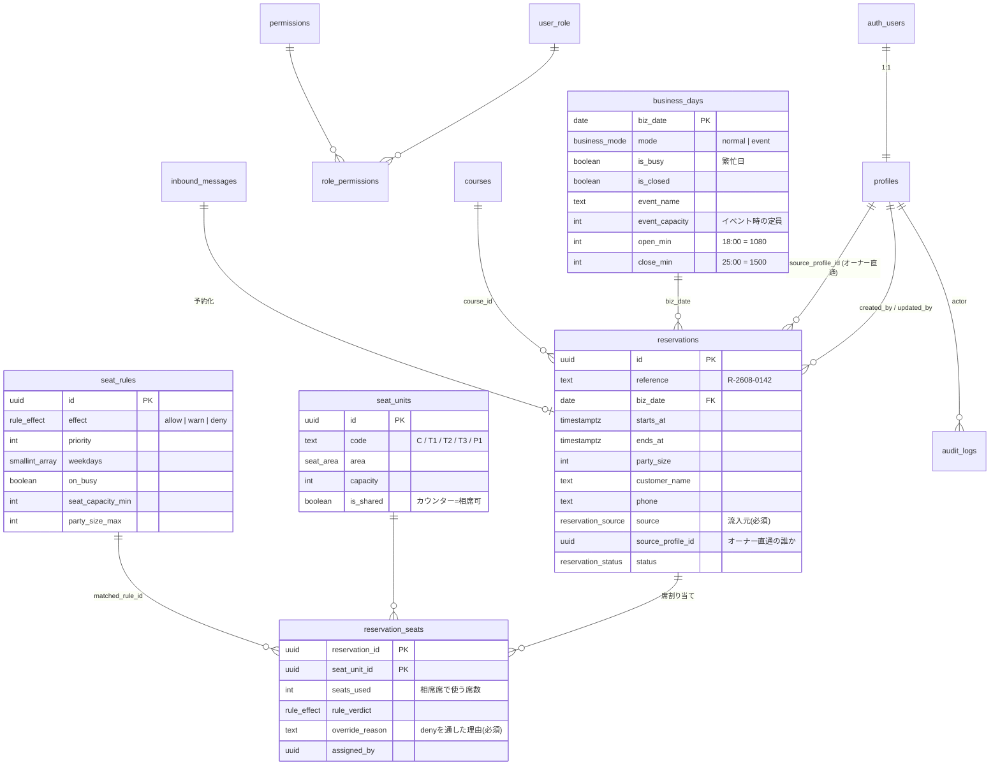

# 3. DB設計

PostgreSQL（Supabase）。以下はそのまま `supabase/migrations/` に置ける形で書いてある。
**まだ適用していない。設計合意後に流す。**

## 3-0. 設計方針

1. **金額は円の整数**。小数を使わない。
2. **時刻は `timestamptz` で保存**し、表示側で JST に変換する。ただし**営業日 `biz_date` は別カラムで明示的に持つ**（24時をまたぐため、時刻から日付を計算させない）。
3. **削除しない**。キャンセルは状態変更、退職は無効化。記録は残す。
4. **不変条件はDBに書く**。「原則NGの席を理由なしで割り当てられない」「同じ席が二重予約されない」はアプリのバグでは破れない場所に置く。
5. **RLSは必ず有効化**する。アプリを信用しない。

## 3-1. リレーション全体図



## 3-2. 型定義

```sql
create extension if not exists "pgcrypto";
create extension if not exists "btree_gist";   -- 席の二重予約を防ぐ排他制約に必要
create extension if not exists "pg_trgm";      -- お客様名のあいまい検索

create type user_role          as enum ('owner', 'manager', 'staff', 'viewer');
create type business_mode      as enum ('normal', 'event');
create type seat_area          as enum ('counter', 'table', 'private');
create type reservation_source as enum ('web_form', 'instagram_dm', 'line', 'phone', 'owner_direct', 'walk_in', 'other');
create type reservation_status as enum ('tentative', 'confirmed', 'seated', 'completed', 'no_show', 'cancelled');
create type rule_effect        as enum ('allow', 'warn', 'deny');
```

> **ロールを後から増やすとき**は `alter type user_role add value 'kitchen';` の1行で足りる。
> 「何ができるか」は次節の `role_permissions` に行を足すだけで決まるので、アプリのコード変更は不要。

## 3-3. 権限（permissions / role_permissions）

```sql
-- スタッフ（auth.users と 1:1）
create table profiles (
  id                   uuid primary key references auth.users on delete cascade,
  login_id             text not null unique,
  display_name         text not null,
  role                 user_role not null default 'staff',
  is_active            boolean not null default true,
  must_change_password boolean not null default true,
  is_owner_contact     boolean not null default false,  -- 「オーナー直通」の選択肢に出すか
  sort_order           integer not null default 100,
  created_at           timestamptz not null default now(),
  constraint profiles_login_id_format check (login_id ~ '^[a-z0-9][a-z0-9._-]{1,30}$')
);
comment on column profiles.login_id is
  'ログイン画面で入力するID。サーバー側で {login_id}@shipporitei.local に変換して Supabase Auth に渡す。';
comment on column profiles.is_owner_contact is
  'オーナー3名など、予約の「オーナー直接」で誰経由かを選ばせる相手。';

-- 権限マスタ（コードで参照する定数）
create table permissions (
  code  text primary key,
  label text not null
);

insert into permissions (code, label) values
  ('reservation.read',  '予約の閲覧'),
  ('reservation.write', '予約の登録・編集・席割り当て'),
  ('reservation.override', '席ルールの上書き'),
  ('businessday.write', '営業モード・繁忙日・営業時間の変更'),
  ('rule.write',        '席割り当てルールの編集'),
  ('stats.read',        '集計の閲覧・CSV出力'),
  ('settings.write',    '店舗設定・席マスタ・コースの編集'),
  ('account.write',     'スタッフアカウントの発行・停止'),
  ('audit.read',        '監査ログの閲覧');

-- ロール → 権限（ここに行を足すだけで権限を細分化できる）
create table role_permissions (
  role       user_role not null,
  permission text not null references permissions(code) on delete cascade,
  primary key (role, permission)
);

insert into role_permissions (role, permission)
select 'owner', code from permissions
union all
select 'manager', code from permissions
  where code <> 'account.write'
union all
select 'staff', code from permissions
  where code in ('reservation.read','reservation.write','reservation.override','stats.read')
union all
select 'viewer', code from permissions
  where code in ('reservation.read');
```

### 初期アカウント（現メンバー9名）

`auth.users` への登録が必要なので、SQLの直書きではなく**アプリの発行APIまたは初期セットアップスクリプト**
（`service_role` キーで Supabase Auth に作成 → `profiles` を挿入）で作る。

```ts
// scripts/seed-accounts.ts で流す初期メンバー
const MEMBERS = [
  { login_id: "koga",      display_name: "古賀 龍馬",     role: "owner",   is_owner_contact: true,  sort_order: 10 },
  { login_id: "yamamoto",  display_name: "山本 善洋",     role: "owner",   is_owner_contact: true,  sort_order: 20 },
  { login_id: "oka",       display_name: "岡 宣行",       role: "owner",   is_owner_contact: true,  sort_order: 30 },
  { login_id: "watanabe",  display_name: "渡邊 祐人",     role: "manager", is_owner_contact: false, sort_order: 40 }, // 店長
  { login_id: "ando",      display_name: "安藤 正",       role: "staff",   is_owner_contact: false, sort_order: 50 },
  { login_id: "kanemoto",  display_name: "金本 絵美",     role: "staff",   is_owner_contact: false, sort_order: 60 },
  { login_id: "yasui",     display_name: "安井 琉惺",     role: "staff",   is_owner_contact: false, sort_order: 70 },
  { login_id: "takagi",    display_name: "高木 雅也",     role: "staff",   is_owner_contact: false, sort_order: 80 },
  { login_id: "shiraishi", display_name: "白石 湧駕",     role: "staff",   is_owner_contact: false, sort_order: 90 },
];
```

- 全員 `must_change_password = true`。初期パスワードは発行時に**画面へ1度だけ表示**し、口頭で渡す。
- **`is_owner_contact = true` はオーナー3名のみ**。予約の流入元「オーナー直接」で、この3名から選ばせる。
- 店長（渡邊さん）は `manager`＝**アカウント発行以外は全部できる**。人の出入りに関わる操作だけオーナーに残す。
- 同姓・同名が入っても衝突しないよう `login_id` は姓のローマ字。重複が出たら `takagi.m` のように名を足す。

判定関数（RLSとAPIの両方がこれを見る＝判定が2か所に散らない）：

```sql
create or replace function public.has_permission(perm text)
returns boolean language sql stable security definer set search_path = public as $$
  select exists (
    select 1
    from profiles p
    join role_permissions rp on rp.role = p.role
    where p.id = auth.uid()
      and p.is_active
      and rp.permission = perm
  )
$$;

create or replace function public.is_active_user()
returns boolean language sql stable security definer set search_path = public as $$
  select exists (select 1 from profiles p where p.id = auth.uid() and p.is_active)
$$;

revoke execute on function public.has_permission(text) from public, anon;
grant  execute on function public.has_permission(text) to authenticated;
grant  execute on function public.is_active_user()     to authenticated;
```

## 3-4. 店舗マスタ（席・コース・設定）

```sql
-- 席ユニット。カウンターは「相席可・定員10」の1ユニットとして扱う
create table seat_units (
  id          uuid primary key default gen_random_uuid(),
  code        text not null unique,
  name        text not null,
  area        seat_area not null,
  capacity    integer not null check (capacity between 1 and 60),
  min_party   integer not null default 1 check (min_party >= 1),
  is_shared   boolean not null default false,  -- true = 相席可（カウンター）
  is_joinable boolean not null default true,   -- 他ユニットと連結して1組に使えるか
  sort_order  integer not null default 0,
  is_active   boolean not null default true,
  note        text
);

insert into seat_units (code, name, area, capacity, is_shared, is_joinable, sort_order) values
  ('C',  'カウンター',       'counter', 10, true,  false, 10),
  ('T1', 'テーブル席1',      'table',    6, false, true,  20),
  ('T2', 'テーブル席2',      'table',    6, false, true,  30),
  ('T3', 'テーブル席3',      'table',    6, false, true,  40),
  ('P1', '掘りごたつ個室',   'private',  8, false, true,  50);
-- 合計 36席（site/data/site.json の記載と一致）

-- コース／プラン
create table courses (
  id             uuid primary key default gen_random_uuid(),
  name           text not null,
  price_yen      integer check (price_yen is null or price_yen >= 0),
  includes_drink boolean not null default false,
  min_party      integer not null default 1,
  note           text,
  sort_order     integer not null default 0,
  is_active      boolean not null default true
);

insert into courses (name, price_yen, includes_drink, min_party, note, sort_order) values
  ('おまかせ宴会コース', 6000, true, 1, '90分飲み放題付き。季節・ご予算に応じて内容変更', 10),
  ('二次会セット',       1980, true, 2, '21時以降／おばんざい小鉢3種付き',                 20),
  ('飲み放題のみ（90分）', 2000, true, 1, '単品追加',                                    30);

-- 店舗の既定値（キーバリュー）
create table settings (
  key        text primary key,
  value      jsonb not null,
  updated_by uuid references profiles(id),
  updated_at timestamptz not null default now()
);

insert into settings (key, value) values
  ('closed_weekdays',        '[2]'::jsonb),                -- 0=日 … 2=火 … 6=土
  ('default_open_min',       '1080'::jsonb),               -- 18:00
  ('default_close_min',      '{"weekday":1440,"friday_saturday":1500}'::jsonb),  -- 24:00 / 25:00
  ('default_stay_min',       '120'::jsonb),                -- 標準滞在時間
  ('default_event_capacity', '60'::jsonb),                 -- ★要確定
  ('max_party_normal',       '36'::jsonb);                 -- 団体一体利用の上限
```

> **`open_min` / `close_min` は「その営業日の 0:00 からの経過分」**。
> 18:00 = 1080、24:00 = 1440、25:00 = 1500。`time` 型では 25:00 を表現できないため整数で持つ。
> これで「24時をまたぐ営業時間」の扱いが、どの画面でも1つの式で済む。

## 3-5. 営業日（business_days）— 営業モードの切り替え

```sql
create table business_days (
  biz_date       date primary key,
  mode           business_mode not null default 'normal',
  is_busy        boolean not null default false,
  is_closed      boolean not null default false,
  event_name     text,
  event_capacity integer check (event_capacity is null or event_capacity > 0),
  open_min       integer not null default 1080 check (open_min between 0 and 1440),
  close_min      integer not null check (close_min > open_min and close_min <= 2160),
  note           text,
  updated_by     uuid references profiles(id),
  updated_at     timestamptz not null default now(),
  -- イベント営業なら定員が必須（定員管理だけに切り替わるため）
  constraint business_days_event_needs_capacity
    check (mode <> 'event' or event_capacity is not null)
);

create index business_days_mode_idx on business_days (mode) where mode = 'event';
create index business_days_busy_idx on business_days (biz_date) where is_busy;
```

行が無い日は曜日から導出する。予約が入る／設定を触るタイミングで実体化する：

```sql
-- 曜日から既定値を作って行が無ければ挿入する。既にあれば何もしない。
create or replace function public.ensure_business_day(d date)
returns business_days language plpgsql security definer set search_path = public as $$
declare
  dow    int := extract(dow from d);          -- 0=日 … 6=土
  closed boolean;
  cmin   int;
  row    business_days;
begin
  -- settings.closed_weekdays は [2]（火曜）のようなJSON配列
  closed := coalesce(
    (select value @> to_jsonb(dow) from settings where key = 'closed_weekdays'), false);
  cmin := case when dow in (5, 6) then 1500 else 1440 end;   -- 金土は25:00まで

  insert into business_days (biz_date, mode, is_closed, open_min, close_min)
  values (d, 'normal', closed, 1080, cmin)
  on conflict (biz_date) do nothing;

  select * into row from business_days where biz_date = d;
  return row;
end;
$$;
```

## 3-6. 予約（reservations）

```sql
create table reservations (
  id               uuid primary key default gen_random_uuid(),
  reference        text not null unique,                    -- R-2608-0142（電話口で言える番号）
  biz_date         date not null references business_days(biz_date),
  starts_at        timestamptz not null,
  ends_at          timestamptz not null,

  party_size       integer not null check (party_size between 1 and 100),
  customer_name    text not null check (length(btrim(customer_name)) > 0),
  customer_kana    text,
  phone            text,

  -- ▼ 流入元（必須。ここが集計の根幹）
  source             reservation_source not null,
  source_profile_id  uuid references profiles(id),          -- owner_direct のとき「誰経由か」
  source_detail      text,                                  -- IGアカウント名・紹介者名など
  external_ref       text,                                  -- LINEのmessageId等（受信箱と突き合わせる）

  status           reservation_status not null default 'tentative',
  is_exclusive     boolean not null default false,          -- 貸切（25名〜）
  course_id        uuid references courses(id),
  drink_plan       boolean not null default false,
  budget_yen       integer check (budget_yen is null or budget_yen >= 0),
  needs_invoice    boolean not null default false,          -- 領収書・請求書
  invoice_name     text,                                    -- 宛名
  allergy          text,
  memo             text,

  cancelled_at     timestamptz,
  cancel_reason    text,
  created_by       uuid references profiles(id),
  updated_by       uuid references profiles(id),
  created_at       timestamptz not null default now(),
  updated_at       timestamptz not null default now(),

  constraint reservations_time_order check (ends_at > starts_at),
  -- オーナー直通なら誰経由かを必ず記録する
  constraint reservations_owner_direct_needs_person
    check (source <> 'owner_direct' or source_profile_id is not null),
  -- キャンセルは理由を残す
  constraint reservations_cancel_reason
    check (status <> 'cancelled' or (cancel_reason is not null and length(btrim(cancel_reason)) > 0))
);

create index reservations_bizdate_idx  on reservations (biz_date, starts_at);
create index reservations_status_idx   on reservations (status) where status in ('tentative','confirmed','seated');
create index reservations_source_idx   on reservations (source, biz_date);
create index reservations_phone_idx    on reservations (phone);
create index reservations_name_trgm    on reservations using gin (customer_name gin_trgm_ops);
```

### 受付番号の採番

```sql
create table reference_counters (period text primary key, n integer not null default 0);

create or replace function public.assign_reference()
returns trigger language plpgsql as $$
declare p text; v int;
begin
  if new.reference is not null then return new; end if;
  p := to_char(new.biz_date, 'YYMM');
  insert into reference_counters (period, n) values (p, 1)
    on conflict (period) do update set n = reference_counters.n + 1
    returning n into v;
  new.reference := 'R-' || p || '-' || lpad(v::text, 4, '0');
  return new;
end;
$$;

create trigger reservations_assign_reference
  before insert on reservations for each row execute function assign_reference();

-- biz_date の行を必ず存在させる（営業モードが常に解決できる状態を保つ）
create or replace function public.reservations_ensure_day()
returns trigger language plpgsql security definer set search_path = public as $$
begin
  perform public.ensure_business_day(new.biz_date);
  return new;
end;
$$;

create trigger reservations_ensure_day_trg
  before insert or update of biz_date on reservations
  for each row execute function reservations_ensure_day();
```

## 3-7. 席割り当て（reservation_seats）と二重予約の防止

1組が複数の席を使える（テーブル2卓連結で12名）ので中間テーブルにする。

```sql
create table reservation_seats (
  reservation_id  uuid not null references reservations(id) on delete cascade,
  seat_unit_id    uuid not null references seat_units(id)   on delete restrict,
  seats_used      integer check (seats_used is null or seats_used > 0),  -- 相席席で使う席数
  rule_verdict    rule_effect,
  matched_rule_id uuid references seat_rules(id) on delete set null,
  override_reason text,
  assigned_by     uuid references profiles(id),
  assigned_at     timestamptz not null default now(),

  -- ▼ 排他制約のために親から同期する（トリガで自動。手で書かない）
  starts_at  timestamptz not null,
  ends_at    timestamptz not null,
  exclusive  boolean not null,     -- seat_units.is_shared の逆
  holds_seat boolean not null,     -- status が席を押さえる状態か

  primary key (reservation_id, seat_unit_id),

  -- ★ 原則NG(deny)を通すときは理由が必須。アプリのバグでは破れない
  constraint reservation_seats_override_reason
    check (rule_verdict is distinct from 'deny'
           or (override_reason is not null and length(btrim(override_reason)) > 0))
);

-- ★ 専有席の二重予約を、時間帯の重なりで物理的に禁止する
alter table reservation_seats
  add column during tstzrange generated always as (tstzrange(starts_at, ends_at, '[)')) stored;

alter table reservation_seats
  add constraint reservation_seats_no_overlap
  exclude using gist (seat_unit_id with =, during with &&)
  where (exclusive and holds_seat);

create index reservation_seats_unit_idx on reservation_seats (seat_unit_id, starts_at);
```

同期トリガ：

```sql
-- 子行を書くとき、親（予約・席）から非正規化カラムを埋める
create or replace function public.fill_reservation_seat()
returns trigger language plpgsql as $$
declare r reservations; u seat_units;
begin
  select * into r from reservations where id = new.reservation_id;
  select * into u from seat_units   where id = new.seat_unit_id;
  new.starts_at  := r.starts_at;
  new.ends_at    := r.ends_at;
  new.exclusive  := not u.is_shared;
  new.holds_seat := r.status in ('tentative','confirmed','seated','completed');
  if u.is_shared and new.seats_used is null then
    new.seats_used := r.party_size;      -- カウンターは人数分の席を消費する
  end if;
  return new;
end;
$$;

create trigger reservation_seats_fill
  before insert or update on reservation_seats
  for each row execute function fill_reservation_seat();

-- 予約側の時刻・状態が変わったら、子行に伝播させる
create or replace function public.propagate_reservation_to_seats()
returns trigger language plpgsql as $$
begin
  update reservation_seats
     set starts_at  = new.starts_at,
         ends_at    = new.ends_at,
         holds_seat = new.status in ('tentative','confirmed','seated','completed')
   where reservation_id = new.id;
  return new;
end;
$$;

create trigger reservations_propagate_seats
  after update of starts_at, ends_at, status on reservations
  for each row execute function propagate_reservation_to_seats();
```

> **なぜここまでするか**：予約管理システムで一番痛い事故は「同じ個室を2組に約束してしまう」こと。
> アプリの重複チェックは、同時アクセスやバグをすり抜ける。DBの排他制約は**すり抜けない**。
> `cancelled` / `no_show` になった瞬間 `holds_seat = false` になり、席は自動的に空く。

## 3-8. 席割り当てルール（seat_rules）

```sql
create table seat_rules (
  id                uuid primary key default gen_random_uuid(),
  name              text not null,
  effect            rule_effect not null,
  priority          integer not null default 100,   -- 小さいほど先に評価。最初に一致した1件を採用
  weekdays          smallint[],       -- null=全曜日。0=日 … 6=土
  on_busy           boolean,          -- true=繁忙日のみ / false=非繁忙日のみ / null=問わない
  areas             seat_area[],      -- null=全エリア
  seat_capacity_min integer,
  seat_capacity_max integer,
  party_size_min    integer,
  party_size_max    integer,
  applies_from      date,
  applies_to        date,
  message           text,             -- スタッフに見せる説明
  is_active         boolean not null default true,
  created_by        uuid references profiles(id),
  created_at        timestamptz not null default now(),
  updated_at        timestamptz not null default now(),
  constraint seat_rules_weekdays_range
    check (weekdays is null or (select bool_and(w between 0 and 6) from unnest(weekdays) w))
);

create index seat_rules_active_idx on seat_rules (priority) where is_active;
```

初期データ（依頼文の例をそのまま表現したもの）：

```sql
insert into seat_rules (name, effect, priority, weekdays, on_busy, seat_capacity_min, party_size_max, message) values
  ('金土の少人数×大席は原則NG', 'deny', 10, '{5,6}', null, 6, 2,
   '金・土は2名様を6名席へお通ししない運用です。通す場合は理由を記録してください。'),
  ('繁忙日の少人数×大席は原則NG', 'deny', 11, null, true, 6, 2,
   '繁忙日です。2名様を6名席へお通ししない運用です。通す場合は理由を記録してください。');

insert into seat_rules (name, effect, priority, weekdays, on_busy, seat_capacity_min, party_size_max, message) values
  ('平日は少人数でも大席OK', 'allow', 50, '{0,1,3,4}', false, 6, 2,
   '平日は2名様でも6名席へご案内できます。'),
  ('席が大きく空きます',      'warn', 90, null, null, 6, 3,
   'この席は定員に対して人数が少なめです。後から団体のご予約が入る可能性にご注意ください。');
```

### 判定ロジック（アプリ側・SQL関数のどちらでも同じ順序）

```
入力: 予約(biz_date, party_size) × 席候補(seat_unit)
1. その日の business_days を引く（mode / is_busy / 曜日）
2. mode = 'event' なら席判定そのものを行わない（定員判定に切り替え）
3. is_active な seat_rules のうち、以下をすべて満たす行を抽出
     - weekdays が null または dow を含む
     - on_busy が null または is_busy と一致
     - areas が null または seat_unit.area を含む
     - seat_capacity_min/max の範囲に seat_unit.capacity が入る
     - party_size_min/max の範囲に party_size が入る
     - applies_from/to の期間内
4. priority 昇順、同値なら effect の強い順（deny > warn > allow）で並べ、先頭1件の effect を採用
5. 一致が無ければ allow
```

対応するSQL関数（画面・APIから同じものを呼ぶ）：

```sql
create or replace function public.evaluate_seat_rule(
  p_biz_date date, p_party_size int, p_seat_unit_id uuid)
returns table (effect rule_effect, rule_id uuid, message text)
language sql stable set search_path = public as $$
  with day as (
    select b.is_busy, extract(dow from b.biz_date)::int as dow
    from business_days b where b.biz_date = p_biz_date
  ), u as (
    select area, capacity from seat_units where id = p_seat_unit_id
  )
  select r.effect, r.id, r.message
  from seat_rules r, day d, u
  where r.is_active
    and (r.weekdays is null or d.dow = any (r.weekdays))
    and (r.on_busy  is null or r.on_busy = d.is_busy)
    and (r.areas    is null or u.area = any (r.areas))
    and (r.seat_capacity_min is null or u.capacity >= r.seat_capacity_min)
    and (r.seat_capacity_max is null or u.capacity <= r.seat_capacity_max)
    and (r.party_size_min is null or p_party_size >= r.party_size_min)
    and (r.party_size_max is null or p_party_size <= r.party_size_max)
    and (r.applies_from is null or p_biz_date >= r.applies_from)
    and (r.applies_to   is null or p_biz_date <= r.applies_to)
  order by r.priority asc,
           case r.effect when 'deny' then 0 when 'warn' then 1 else 2 end
  limit 1;
$$;
```

## 3-9. 受信箱・監査ログ

```sql
-- LINE / Instagram から自動受信したメッセージ（Phase 5）
create table inbound_messages (
  id             uuid primary key default gen_random_uuid(),
  channel        text not null check (channel in ('line','instagram')),
  external_id    text not null,
  from_id        text,
  from_name      text,
  body           text,
  received_at    timestamptz not null default now(),
  status         text not null default 'new' check (status in ('new','linked','ignored')),
  reservation_id uuid references reservations(id) on delete set null,
  raw            jsonb,
  unique (channel, external_id)         -- Webhookの再送で重複しない
);

-- 監査ログ
create table audit_logs (
  id           bigserial primary key,
  actor        uuid references profiles(id),
  action       text not null,           -- 'reservation.update' 等
  target_table text not null,
  target_id    text,
  before       jsonb,
  after        jsonb,
  at           timestamptz not null default now()
);
create index audit_logs_at_idx     on audit_logs (at desc);
create index audit_logs_target_idx on audit_logs (target_table, target_id);

create or replace function public.write_audit()
returns trigger language plpgsql security definer set search_path = public as $$
begin
  insert into audit_logs (actor, action, target_table, target_id, before, after)
  values (auth.uid(),
          tg_table_name || '.' || lower(tg_op),
          tg_table_name,
          coalesce(new.id::text, old.id::text),
          case when tg_op = 'INSERT' then null else to_jsonb(old) end,
          case when tg_op = 'DELETE' then null else to_jsonb(new) end);
  return coalesce(new, old);
end;
$$;

create trigger reservations_audit   after insert or update or delete on reservations   for each row execute function write_audit();
create trigger business_days_audit  after insert or update or delete on business_days  for each row execute function write_audit();
create trigger seat_rules_audit     after insert or update or delete on seat_rules     for each row execute function write_audit();
create trigger reservation_seats_audit after insert or update or delete on reservation_seats for each row execute function write_audit();
```

## 3-10. 集計ビュー

```sql
-- 営業日サマリー（「今日」画面とカレンダーが使う）
create or replace view v_daily_summary as
select b.biz_date, b.mode, b.is_busy, b.is_closed, b.event_name, b.event_capacity,
       count(r.id) filter (where r.status in ('tentative','confirmed','seated','completed')) as reservation_count,
       coalesce(sum(r.party_size) filter (where r.status in ('tentative','confirmed','seated','completed')), 0) as guest_count,
       count(r.id) filter (where r.status = 'tentative')  as tentative_count,
       count(r.id) filter (where r.status = 'cancelled')  as cancelled_count,
       count(r.id) filter (where r.status = 'no_show')    as no_show_count,
       case when b.mode = 'event'
            then b.event_capacity - coalesce(sum(r.party_size) filter (where r.status in ('tentative','confirmed','seated','completed')), 0)
            else null end as remaining_capacity
from business_days b
left join reservations r on r.biz_date = b.biz_date
group by b.biz_date;

-- 流入元別の集計（/analytics が使う）
create or replace view v_source_stats as
select r.biz_date, r.source, r.source_profile_id,
       count(*)                                        as total,
       count(*) filter (where r.status = 'cancelled')  as cancelled,
       count(*) filter (where r.status = 'no_show')    as no_show,
       sum(r.party_size)                               as guests
from reservations r
group by r.biz_date, r.source, r.source_profile_id;

-- ルール上書きの実績（ルール見直しの材料）
create or replace view v_rule_overrides as
select rs.matched_rule_id, sr.name, count(*) as override_count,
       min(rs.assigned_at) as first_at, max(rs.assigned_at) as last_at
from reservation_seats rs
join seat_rules sr on sr.id = rs.matched_rule_id
where rs.rule_verdict = 'deny'
group by rs.matched_rule_id, sr.name;
```

## 3-11. RLS（行レベルセキュリティ）

```sql
alter table profiles          enable row level security;
alter table permissions       enable row level security;
alter table role_permissions  enable row level security;
alter table seat_units        enable row level security;
alter table courses           enable row level security;
alter table settings          enable row level security;
alter table business_days     enable row level security;
alter table reservations      enable row level security;
alter table reservation_seats enable row level security;
alter table seat_rules        enable row level security;
alter table inbound_messages  enable row level security;
alter table audit_logs        enable row level security;

-- anon（未ログイン）には一切与えない。公開フォームはサーバー側の service role 経由のみ
revoke all on all tables in schema public from anon;

-- 自分の行は常に読める（ログイン直後の状態判定のため）
create policy profiles_select_self on profiles
  for select to authenticated using (id = auth.uid());
create policy profiles_select_all on profiles
  for select to authenticated using (is_active_user());
create policy profiles_write on profiles
  for all to authenticated using (has_permission('account.write')) with check (has_permission('account.write'));

-- 予約：有効なスタッフは読める。書き込みは権限を持つ人だけ
create policy reservations_select on reservations
  for select to authenticated using (is_active_user() and has_permission('reservation.read'));
create policy reservations_insert on reservations
  for insert to authenticated with check (has_permission('reservation.write'));
create policy reservations_update on reservations
  for update to authenticated using (has_permission('reservation.write')) with check (has_permission('reservation.write'));
-- DELETE は誰にも許可しない（キャンセルは status 変更）

-- 席割り当て：上書き(deny を通す)には専用権限を要求する
create policy reservation_seats_select on reservation_seats
  for select to authenticated using (has_permission('reservation.read'));
create policy reservation_seats_write on reservation_seats
  for all to authenticated
  using (has_permission('reservation.write'))
  with check (
    has_permission('reservation.write')
    and (rule_verdict is distinct from 'deny' or has_permission('reservation.override'))
  );

-- 営業日 / ルール / 設定
create policy business_days_select on business_days
  for select to authenticated using (is_active_user());
create policy business_days_write on business_days
  for all to authenticated using (has_permission('businessday.write')) with check (has_permission('businessday.write'));

create policy seat_rules_select on seat_rules
  for select to authenticated using (is_active_user());
create policy seat_rules_write on seat_rules
  for all to authenticated using (has_permission('rule.write')) with check (has_permission('rule.write'));

create policy masters_select on seat_units
  for select to authenticated using (is_active_user());
create policy masters_write on seat_units
  for all to authenticated using (has_permission('settings.write')) with check (has_permission('settings.write'));
-- courses / settings も同型

-- 監査ログは読むだけ（誰も書き換えられない。書き込みは security definer トリガのみ）
create policy audit_select on audit_logs
  for select to authenticated using (has_permission('audit.read'));
```

## 3-12. マイグレーション構成（予定）

```
shippori-reserve/supabase/migrations/
  0001_types_and_profiles.sql      -- enum・profiles・permissions・role_permissions・判定関数
  0002_masters.sql                 -- seat_units・courses・settings＋初期データ
  0003_business_days.sql           -- business_days・ensure_business_day()
  0004_reservations.sql            -- reservations・採番・トリガ
  0005_seat_assignment.sql         -- reservation_seats・排他制約・同期トリガ
  0006_seat_rules.sql              -- seat_rules・evaluate_seat_rule()＋初期ルール
  0007_views.sql                   -- 集計ビュー
  0008_audit.sql                   -- audit_logs・トリガ
  0009_rls.sql                     -- RLS 一式
  0010_inbox.sql                   -- inbound_messages（Phase 5）
```
